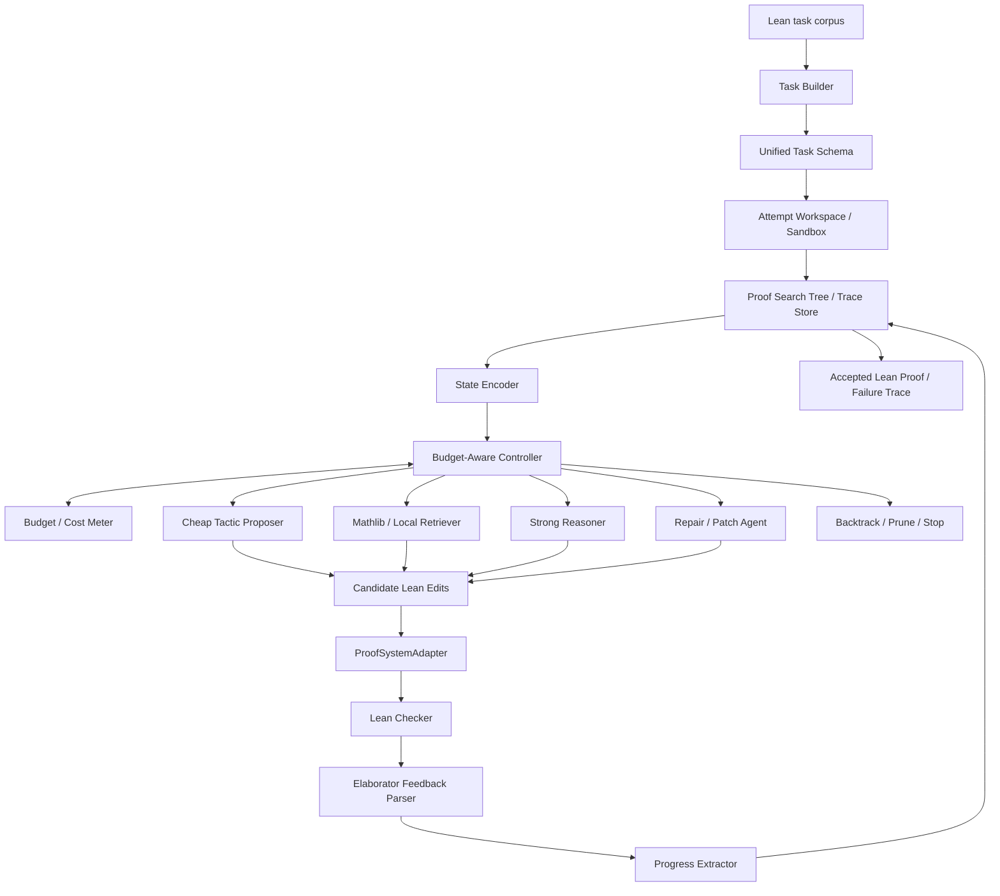

# Cost-Sensitive Search Control for LLM-Guided Formal Proof Agents

## Project Positioning

This project studies how an LLM-based formal proof agent should allocate a limited inference budget. Instead of improving theorem proving mainly through larger models, more samples, or expensive training, the focus is on search control: when to expand a branch, repair a failed proof step, retrieve supporting lemmas, backtrack, prune, or escalate to a stronger model.

The implementation target is Lean 4. Lean is a good fit for the initial system because it has an active LLM theorem-proving ecosystem, strong Mathlib infrastructure, practical compiler feedback, and a relatively convenient path for proof-state extraction and automated checking. Isabelle/HOL remains useful background and future comparison material, especially because the Archive of Formal Proofs contains a mature formalization of optimal binary search trees (OBST).

The first benchmark should therefore be Lean-first: start with small theorem-completion tasks from Mathlib-style developments or a local Lean formalization of OBST. Isabelle AFP `Optimal_BST` should be treated as future comparison material rather than an MVP dependency. In both cases, OBST is useful because the mathematics is classical, the proof chain is nontrivial, and the final proofs are machine-checkable.

> Working title: **Cost-Sensitive Search Control for LLM-Guided Formal Proof Agents**
>
> Subtitle: **A Case Study on Formally Verified Optimal Binary Search Trees**

## Related Work

### Optimal Binary Search Trees and Formal Verification

Optimal binary search trees are a classical dynamic programming problem. Knuth's work on optimum binary search trees established the dynamic programming recurrence and the root monotonicity property that enables the well-known \(O(n^2)\) optimization. Yao's quadrangle-inequality framework later generalized monotonicity-based dynamic programming speedups, connecting OBST to a broader family of optimized DP algorithms. Related lines of work on Knuth-Yao speedups, total monotonicity, and SMAWK provide alternative proof paths for similar structural properties.

The most relevant formal artifact is the AFP entry [Optimal Binary Search Trees](https://isa-afp.org/entries/Optimal_BST.html), which formalizes OBST algorithms and their correctness in Isabelle/HOL, including sessions such as `Weighted_Path_Length`, `Optimal_BST`, `Quadrilateral_Inequality`, `Optimal_BST2`, `Optimal_BST_Code`, and `Optimal_BST_Memo`. For this project, OBST is not the novelty claim itself. Its role is to provide a structured, reproducible, verifier-backed proof corpus where search trajectories can be measured precisely.

This makes OBST a good controlled benchmark for proof-agent research: the target theorems are known to be provable, the dependencies are explicit, and the proof scripts can be decomposed into smaller completion tasks.

### LLM-Guided Formal Theorem Proving

Recent neural theorem proving systems typically follow a generate-and-verify loop: an LLM proposes proof steps or full proof scripts, and a formal verifier checks them. GPT-f is an early influential example of this paradigm in Metamath, showing that language models can generate proofs accepted by a formal system and even contribute proofs of community interest.

In Lean, systems such as [Lean Copilot](https://arxiv.org/abs/2404.12534) provide engineering infrastructure for tactic suggestion, proof search, and premise selection. These systems are useful references for proof-state interaction, Mathlib-aware retrieval, and tool integration.

Large-scale provers such as DeepSeek-Prover, AlphaProof, and Seed-Prover demonstrate the power of combining formal corpora, verifier feedback, retrieval, reinforcement learning, and large amounts of test-time search. They form an important contrast for this project: their gains often depend on heavy training or high sampling budgets, while this project asks how far better control can go under constrained budgets.

[APOLLO](https://arxiv.org/abs/2505.05758) is especially close in spirit because it uses Lean compiler feedback, proof repair, subgoal isolation, and automated solvers to improve success under a lower sampling budget. It supports the broader claim that theorem proving efficiency is not only a model-size problem; it is also an agent-loop and feedback-use problem.

[A Minimal Agent for Automated Theorem Proving](https://arxiv.org/abs/2602.24273) is a useful engineering baseline. It studies an iterative proof-refinement loop with library search and context management. This project can use that kind of ordinary agent loop as a baseline, then isolate the contribution of a budget-aware controller.

### Autoformalization and Proof Benchmarks

Autoformalization work studies how natural-language mathematical statements and proofs can be converted into formal statements and proof scripts. Benchmarks such as [ProofNet](https://arxiv.org/abs/2302.12433) connect undergraduate-level mathematics with Lean statements and natural-language proofs, and they show that LLM proof systems are sensitive to statement phrasing, context, and decomposition.

For the first stage of this project, full autoformalization should be treated as adjacent work rather than the central problem. Starting from existing Lean theorem statements keeps the scope sharper: the system can focus on proof-search control under budget constraints, rather than simultaneously solving natural language to formal language translation.

### Budget-Aware Test-Time Search and Metareasoning

The closest methodological neighbors are recent works on budget-aware test-time search. [Spend Less, Reason Better: Budget-Aware Value Tree Search for LLM Agents](https://arxiv.org/abs/2603.12634) proposes Budget-Aware Value Tree Search (BAVT), a training-free inference-time framework for multi-hop reasoning. BAVT treats reasoning as a dynamic search tree, conditions node selection on the remaining budget, and uses residual value estimation to reduce overconfident absolute self-evaluation.

BAVT is highly relevant because it studies the same high-level question: how should an LLM agent spend limited inference resources? The key difference is the evaluation signal. BAVT focuses on multi-hop question answering, where intermediate states are mostly evaluated by the LLM itself. Formal proof search has a symbolic verifier in the loop: candidate steps can be checked, failures can be typed, and proof-state changes can be measured. This enables controllers that combine LLM value estimates with verifier feedback, proof-state progress, branch repairability, and dependency retrieval.

[Aligning Tree-Search Policies with Fixed Token Budgets in Test-Time Scaling of LLMs](https://arxiv.org/abs/2602.09574) proposes BG-MCTS, another budget-aware tree-search method. Its central lesson is useful for this project: budget should not only be a stopping condition; it should shape the search policy throughout execution. In formal proof search, this suggests shifting from broad exploration early in the budget to repair, completion, and high-confidence branches as the remaining budget shrinks.

These works connect naturally to rational metareasoning and value-of-computation ideas: each LLM call, verifier call, retrieval step, repair attempt, or model escalation is a costly computation action. The agent's objective is therefore not simply to find a proof, but to maximize proof success under fixed token, time, API, and verifier-call budgets.

## Research Gap

Most LLM theorem proving systems improve performance by scaling one or more of the following:

- model size;
- number of generated samples;
- verifier calls;
- retrieval corpus size;
- supervised fine-tuning or reinforcement learning data.

Less attention has been paid to the controller that decides how to spend a fixed budget during the proof attempt. This project studies that controller directly.

The central hypothesis is:

> A verifier-guided proof agent can solve more formal proof tasks under the same budget by making budget-aware decisions about expansion, repair, retrieval, pruning, backtracking, and model escalation.

The accompanying theoretical framing is recorded in
[`docs/theory.md`](docs/theory.md). The key claim is conditional rather than
absolute: search is cheaper when the expected success gain of a cheap action
exceeds its cost relative to direct escalation, and sequential proof attempts
should be ordered by estimated success gain per unit cost.

## System Architecture



The architecture is deliberately split into a proof-system adapter and a search/controller layer. The MVP only implements the Lean backend, but it should still expose a small `ProofSystemAdapter` boundary so the controller does not directly call `lake build`, parse Lean diagnostics, or manipulate generated files.

The key design constraint is to keep this adapter minimal. It is an interface boundary, not a full multi-prover abstraction layer. The first implementation should support Lean well, while making the future Isabelle path plausible rather than complete.

## Core Modules

The current data-structure and module-interface contracts are recorded in
[`docs/interfaces.md`](docs/interfaces.md). That document is the implementation
guide for the MVP boundary between task construction, candidate rendering,
checking, workspace materialization, and the future cost-sensitive controller.

### ProofSystemAdapter

The MVP should implement only `LeanAdapter`, but the controller should depend on a small proof-system interface:

```text
render_candidate(task, candidate_edit) -> candidate_source
check(candidate_file, budget_slice) -> CheckResult
parse_feedback(raw_output) -> ParsedFeedback
extract_progress(parent_state, check_result) -> ProgressSignal
```

For Lean, the adapter handles imports, proof holes, `lake build` or Lean server checks, diagnostics, timeouts, and proof-state snapshots. The workspace layer owns generated files and candidate directories. The search controller should see normalized task state, parsed feedback, and progress signals, not raw Lean implementation details.

This interface should stay intentionally narrow in the MVP. Do not try to design a complete Isabelle-compatible abstraction upfront. The immediate goal is to prevent Lean-specific execution details from leaking into the controller.

### Proof Task Builder

For the Lean-first version, build tasks from a local Lean project. Each task should include:

- imports and local context;
- theorem statement;
- partial proof prefix;
- target proof hole;
- ground-truth proof script;
- dependency lemmas.

The first stage should avoid asking the agent to formalize or reprove an entire development from scratch. A better MVP is proof completion: given a theorem statement and a partial proof prefix, complete the next tactic block or the remaining lemma.

The task builder should also record dataset provenance:

- source file and theorem name;
- task split, such as dev or test;
- whether ground-truth proof text is hidden from retrieval;
- allowed retrieval scope for local files and examples.

This is mainly a leakage guard. Ground-truth proofs are useful for evaluation and task construction, but they should not be visible to the proposer, retriever, or repair agent during a test run.

Recommended task levels:

- **Level 1: tactic-hole completion**. Replace one `sorry` or `by` block inside a small theorem.
- **Level 2: lemma completion**. Complete a whole lemma whose statement and imports are fixed.
- **Level 3: dependency-aware completion**. Complete a lemma after retrieving nearby lemmas and definitions.
- **Level 4: mini-development**. Prove a small chain of lemmas for an OBST-related property.

### State Encoder

Represent the current Lean state in a compact form:

- current subgoals;
- local assumptions;
- available facts;
- proof prefix;
- recent elaborator or tactic error;
- search-node depth;
- remaining budget;
- repeated failure history for the branch.

For Lean, the state encoder should preserve enough information for tactic repair:

- goal type and local hypotheses;
- imported modules;
- open namespaces;
- definitions and theorem names appearing in the file;
- nearby successful proof snippets;
- exact compiler diagnostic span when available.

The encoded state should separate prover-neutral fields from Lean-specific fields. For example, `goals`, `local_context`, `recent_error_category`, `remaining_budget`, and `branch_history` are controller-facing. Lean syntax, raw diagnostics, file paths, and import mechanics should remain adapter-facing unless explicitly needed by a prompt.

### Action Space

The controller chooses among meta-actions rather than only asking the model for another proof step:

- `expand_cheap`: generate candidate Lean tactics or proof terms with a cheap model;
- `retrieve`: retrieve similar Mathlib/local lemmas or proof snippets;
- `repair`: use Lean diagnostics to fix the current failed candidate;
- `decompose`: ask a stronger model to propose intermediate lemmas or subgoals;
- `escalate`: call a stronger model;
- `backtrack`: return to an earlier node;
- `prune`: abandon an unpromising branch;
- `stop`: terminate after success or budget exhaustion.

For the first implementation, keep the edit format simple: candidate actions should be patches to a single proof hole, not arbitrary whole-file rewrites. That makes verification, blame assignment, and trace comparison much cleaner.

The MVP should treat each meta-action as a budgeted operation. Even retrieval and checker calls consume budget, because they can dominate runtime or indirectly increase token use.

### Attempt Workspace and Trace Store

Candidate proof attempts should run in an isolated generated workspace:

- materialize each candidate from a task template and a single-hole edit;
- avoid modifying source task files;
- assign each candidate a stable hash from task id, parent node, action, and edit text;
- cache checker results for repeated candidates;
- record timeouts and failed checks as first-class trace events.

This module should stay simple: a generated directory plus deterministic filenames is enough for the first version. The important part is reproducibility and avoiding cross-candidate contamination.

### Budget-Aware Controller

A simple first controller can be heuristic rather than learned:

```text
score(node, action)
= estimated_success_gain(node, action)
  / estimated_cost(action)
```

The estimated gain can combine verifier-derived and model-derived signals:

```text
estimated_success_gain =
  alpha  * verifier_progress
+ beta   * novelty
+ gamma  * retriever_similarity
+ delta  * model_confidence
- eta    * repeated_error_penalty
- lambda * depth_penalty
```

BAVT suggests a stronger budget-conditioned node priority:

```text
priority(node)
= value(node) ^ gamma(b_remaining)
  / cost_to_expand(node)

b_remaining = remaining_budget / total_budget
```

The intended behavior is:

- when budget is plentiful, explore more broadly;
- when budget is low, exploit high-value nodes and prefer completion or repair;
- when a branch repeats the same verifier failure, prune or backtrack earlier.

The budget manager should track a small set of cost counters:

- cheap-model calls and tokens;
- strong-model calls and tokens;
- verifier calls and elapsed checker time;
- retrieval calls;
- repair attempts;
- wall-clock timeout events.

This should not become a complicated accounting system in the MVP. It only needs to make runs comparable and let the controller condition decisions on remaining budget.

### Residual Value for Proof Search

Instead of asking the model to score an absolute proof state, ask whether a child node improved over its parent:

```text
residual_value(child, parent)
= progress(child) - progress(parent)
```

In theorem proving, progress can be estimated from verifier signals:

- fewer subgoals;
- simpler or more specific subgoals;
- longer verified proof prefix;
- error category improved from syntax/type failure to unresolved goal;
- retrieved lemma matches current constants or assumptions;
- fewer repeated failures on the same branch.

Some Lean progress signals are ambiguous. Splitting one hard goal into several easy goals can be progress even though the subgoal count increases. The MVP should therefore use a small feature vector rather than a single scalar too early:

- accepted proof prefix length;
- diagnostic category transition;
- goal count delta;
- rough goal-size delta;
- whether the candidate introduced new unresolved obligations;
- whether the candidate moved from parser/name errors to semantic proof obligations.

The controller can still collapse these features into a heuristic score, but the trace should preserve the raw components for later analysis.

### Verifier Feedback Parser

Verifier output should be classified rather than treated as pass/fail only:

- syntax error;
- unknown fact;
- type mismatch;
- failed proof method;
- unsolved subgoal;
- timeout;
- proof completed.

This classification matters because different failures have different repairability. A syntax error may be cheap to fix; repeated unknown facts may suggest retrieval; persistent unsolved subgoals may require decomposition or backtracking.

For Lean, useful first-pass diagnostic categories are:

- parser error;
- unknown identifier;
- type mismatch;
- unsolved goals;
- tactic failed;
- termination or recursion issue;
- unused or invalid theorem reference;
- timeout;
- proof accepted.

The feedback parser should also record whether the candidate got farther than its parent. A proof that changes an error from `unknown identifier` to `unsolved goals` is still useful evidence for repair, even if it is not accepted.

## Lean-First Implementation Plan

### Repository Layout

```text
cssc/
  README.md
  lean_workspace/
    lakefile.lean
    Cssc/
      Tasks/
        Basic.lean
        ObstMini.lean
      Generated/
        Attempt.lean
  agent/
    proof_system_adapter.py
    task_builder.py
    lean_adapter.py
    workspace.py
    state_encoder.py
    retriever.py
    controller.py
    budget.py
    proposer.py
    repair.py
    trace_store.py
  data/
    tasks.jsonl
    traces/
    reports/
```

### Main Loop

```text
for task in task_set:
    initialize root node from theorem statement + proof prefix
    while budget remains:
        encode current proof-search frontier
        controller chooses action
        budget manager allocates a small budget slice
        action creates one or more candidate Lean edits
        adapter renders candidate source
        workspace writes isolated candidate files
        proof-system adapter checks each candidate
        parser classifies diagnostics
        progress extractor computes progress signals
        trace store records cost, result, and parent-child edge
        if proof accepted:
            return solved proof
    return failure trace
```

### Lean Adapter

The Lean adapter is the most important engineering component in the MVP. It should provide a narrow interface:

```text
check(candidate_file, budget_slice) -> CheckResult
```

`CheckResult` should include:

- accepted or rejected;
- raw Lean output;
- normalized error category;
- diagnostic line and column;
- unsolved goals if available;
- elapsed checker time;
- verified proof prefix length;
- imported modules and task id.

In the simplest version, `check` can call `lake build` on a generated Lean file with a timeout. Later, this can be upgraded to a Lean server or REPL-style interface for faster proof-state extraction. The adapter should implement the `ProofSystemAdapter` interface, but the MVP does not need a second backend.

### Retriever

The retriever should start lightweight:

- lexical search over local Lean files;
- theorem-name search by constants in the goal;
- nearest-neighbor retrieval over theorem statements and proof snippets if embeddings are available;
- optional Mathlib docs or source-code search.

The output should be short and structured: theorem name, statement, import path, and one or two nearby usage examples. Retrieval should be budgeted like any other action.

### Controller MVP

Start with a heuristic controller before trying learning:

```text
if syntax/parser error:
    prefer repair
elif unknown identifier:
    prefer retrieve or repair imports/names
elif type mismatch:
    prefer repair with local context
elif unsolved goals decreased:
    continue expanding this branch
elif repeated same error >= k:
    prune or backtrack
elif cheap budget is nearly exhausted and branch value is high:
    escalate
else:
    best-first expand by residual value / estimated cost
```

This is enough to test the research question before committing to a learned policy.

The first controller should be deliberately small:

- fixed cost table for each action type;
- fixed error-category policy rules;
- best-first frontier ordered by progress-per-cost;
- simple budget phase, such as high/mid/low remaining budget;
- no learned value model in the first version.

This keeps the architecture testable without burying the project in policy-learning machinery too early.

## MVP Experiments

### Task Definition

```text
Input: theorem statement + imports + partial proof prefix
Goal: complete the proof
Budget: max verifier calls, max cheap-model calls, max expensive-model calls
Output: accepted Lean proof script
```

### Baselines

1. `DFS + cheap model`
2. `Best-first + cheap model`
3. `Fixed escalation`: call the strong model after every N failed attempts
4. `Budget-aware controller`: choose expand, repair, retrieve, escalate, prune, or backtrack using budget-conditioned scoring

Minimal ablations should compare controllers with the same available tools:

1. `Best-first, no budget conditioning`
2. `Budget-aware, no retrieval`
3. `Budget-aware, no repair`
4. `Budget-aware, no escalation`

These ablations are enough for the first paper-style evaluation. Larger experiments can wait until the Lean task set and trace pipeline are stable.

### Metrics

- number of solved proof tasks under a fixed budget;
- average token cost per solved task;
- expensive model calls per solved task;
- verifier calls per solved task;
- proof-completion success rate;
- branch-pruning accuracy;
- failure distribution by verifier error category;
- timeout rate and repeated-candidate cache hits.

## One-Sentence Contribution

Unlike prior LLM theorem provers that mainly improve performance through larger models, more samples, or training, this project studies cost-sensitive search control for formal proof agents. It uses Lean proof-completion tasks as the primary testbed, with OBST-style developments and Isabelle AFP as optional controlled benchmarks, and evaluates when an agent should expand, repair, retrieve, backtrack, prune, or escalate under a fixed budget.

## References to Track

- Donald E. Knuth. *Optimum Binary Search Trees*. Acta Informatica.
- F. Frances Yao. *Efficient Dynamic Programming Using Quadrangle Inequalities*.
- Archive of Formal Proofs. [Optimal Binary Search Trees](https://isa-afp.org/entries/Optimal_BST.html).
- Stanislas Polu and Ilya Sutskever. [Generative Language Modeling for Automated Theorem Proving](https://arxiv.org/abs/2009.03393).
- Lean Copilot. [Large Language Models as Copilots for Theorem Proving in Lean](https://arxiv.org/abs/2404.12534).
- ProofNet. [Autoformalizing and Formally Proving Undergraduate-Level Mathematics](https://arxiv.org/abs/2302.12433).
- APOLLO. [Automated LLM and Lean Collaboration for Advanced Formal Reasoning](https://arxiv.org/abs/2505.05758).
- DeepSeek-Prover-V2. [DeepSeek-Prover-V2: Advancing Formal Mathematical Reasoning via Reinforcement Learning for Subgoal Decomposition](https://arxiv.org/abs/2504.21801).
- A Minimal Agent. [A Minimal Agent for Automated Theorem Proving](https://arxiv.org/abs/2602.24273).
- BAVT. [Spend Less, Reason Better: Budget-Aware Value Tree Search for LLM Agents](https://arxiv.org/abs/2603.12634).
- BG-MCTS. [Aligning Tree-Search Policies with Fixed Token Budgets in Test-Time Scaling of LLMs](https://arxiv.org/abs/2602.09574).
